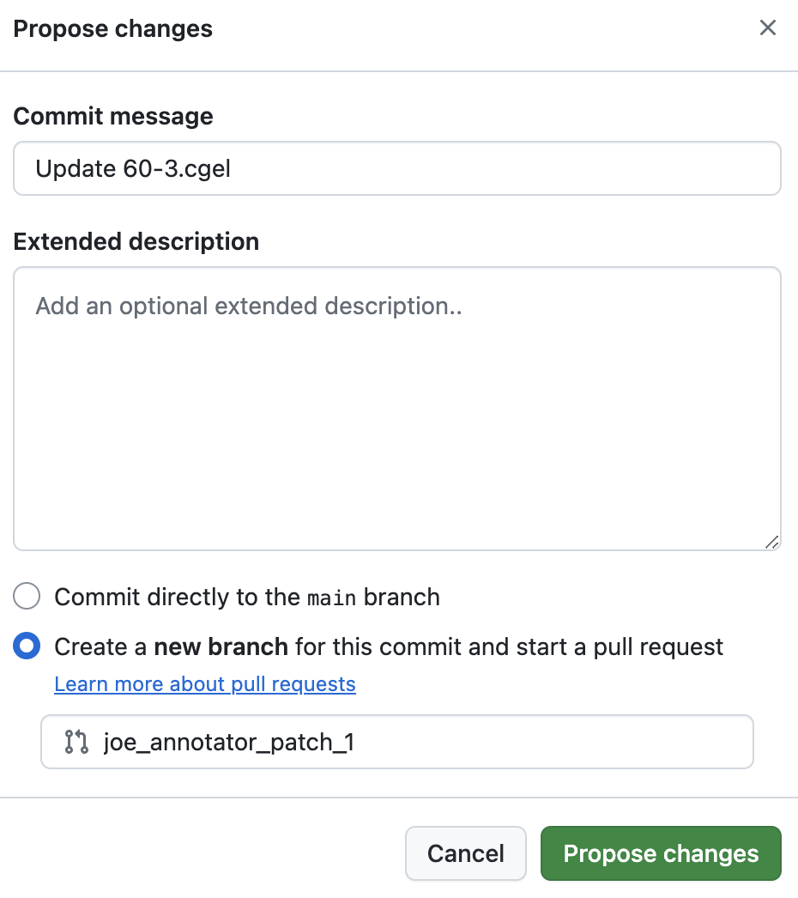

# Instructions for contributing treebank annotations

This file documents the procedure for contributing trees to the legal-cgel treebank. As of writing (08/12/2024), we are in the process of adding and adjudicating 'one-off' trees of (pseudo) randomly-selected sentences from the U.S. Code. These trees are maintained in `/datasets/oneoff/` (henceforth the 'oneoff' folder), with associated LaTeX source code and .pdf-rendered LaTeX in `/datasets/oneoff/tex` and `/datasets/oneoff/pdf`, respectively. 

These instructions assume that you've been assigned one-off sentences to annotate, and that a project contributor with write privileges to `main` has added "stubs" of your annotations to the oneoff folder. A stub is a .cgel file with populated fields `# sent_id`, `# text`, `# sent`, and `# tree_by`. As of right now, assume one stub per tree. Here's an example stub: 

```
# sent_id = 60-3
# text = The professor who taught me linear algebra is very kind.
# sent = the professor who -- taught me linear algebra is very kind
# tree_by = joe_annotator (YYYY-MM-DD)
```

The above stub relates to a sentence assigned to Joe Annotator; the `# tree_by` field includes Joe's GitHub username and the string `(YYYY-MM-DD)`, which Joe will update with the date Joe adds a CGELBank tree to the stub. The `# text` field includes the sentence string prior to any tokenization performed by Joe; `# sent` is the sentence after tokenization. Note that all tokens are lowercased (even if sentence-initial), unless the token is conventionally capitalized regardless of sentence position. Note as well that gaps are notated in this field as `--` (which is different than the gap token `_.` we currently assume for annotation in activedop). Currently, `# sent_id` is a sequence of the form `N-M` where `N` and `M` are integers. (Soon, these IDs will be updated, but for now, just enter the `N-M` sequence that came with the sentence when it was assigned for annotation). 

## 1. Annotator adds the CGELBank tree to the stub

In our example, Joe Annotator makes his contribution by adding his CGELBank tree to the stub. (This can be achieved in the GitHub, this can be achieved by navigating to the stub file and clicking the pen icon in the righthand corner). Joe Annotator then updates the date in the `# tree_by` field. The abridged result is as follows:

```
# sent_id = 60-3
# text = The professor who taught me linear algebra is very kind.
# sent = the professor who -- taught me linear algebra is very kind
# tree_by = joe_annotator (2024-08-12)
(Clause
    :Subj (NP
        :Det (DP
            :Head (D :t "the"))
        :Head (NP
            :Head (Nom
                :Head (N :t "professor")
            [...]
            :Mod (AdvP
                :Head (Adv :t "very"))
            :Head (Adj :t "kind"))))
```

## 2. Annotator commits the addition on a new branch (and makes a pull request on the main branch)

After editing the tree, click the green "Commit changes..." button. In the popup window, select the option "Create a **new branch** for this commit and start a pull request". There is no need to alter the "Commit message", "Extended description", or branch name fields fields; just click the "Propose changes" button to make a pull request on the main branch. Just before clicking "Propose changes", Joe's popup window looks like this: 



The .tex and .pdf conversions of the tree are automatically added to this branch as a new git commit. (This may take a couple minutes).

## 3. Annotator and reviewer discuss the tree

If necessary, the reviewer will request changes to the annotator's work. In that case, the annotator can update their tree by editing the .cgel file as before but selecting "Commit directly to the `[annotator_patch]` branch", where `[annotator_patch]` is the name of the branch the annotator created when making the pull request. (In our example, `joe_annotator_patch_1`). Upon commiting any changes, the branch will automatically update with new .tex and .pdf. 

## 4. Reviewer merges the tree to the main branch

Before doing so, reviewer updates `# tree_by` to identify the reviewer and date of the review, e.g.:

```
# tree_by = joe_annotator (2024-08-12) rev. bwaldon (2024-08-12)
```
